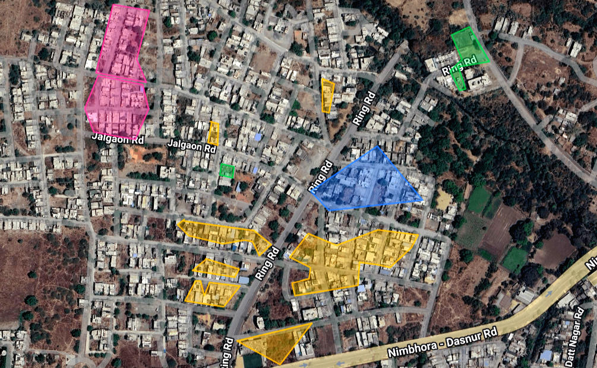

# 🌿 Faltric

**Decentralized Renewable Energy Marketplace & AI-Driven Grid Intelligence**

> _"Empowering communities to own, trade, and sustain clean energy — one kilowatt at a time."_

---

## 🔍 Problem Understanding & Clarity


India's energy landscape suffers from a **critical last-mile gap**: millions of households with rooftop solar panels, small biogas units, or micro-wind setups generate surplus renewable energy but have **no mechanism to monetize or redistribute it**. The current grid model is centralized, opaque, and painfully slow — leaving prosumers (producer + consumer) stranded, while urban demand spikes go unmet and clean energy is wasted daily.

### The Core Problem

| Issue                                                    | Scale                                                 |
| -------------------------------------------------------- | ----------------------------------------------------- |
| Decentralized solar prosumers unable to sell surplus     | ~10 million rooftop solar households in India         |
| No peer-to-peer energy market exists at hyperlocal level | 0 legally decentralized P2P markets active nationally |
| Carbon credit tracking is fragmented and non-auditable   | Billions in potential carbon revenue unclaimed        |
| Rural energy entrepreneurs locked out of monetization    | 650 million rural residents underserved               |

**Faltric** directly addresses this: a platform where any energy producer — a farmer with a solar pump, a housing society with rooftop panels, or a biogas plant — can **tokenize, list, and trade** their surplus energy in real time with nearby consumers or the grid. The sustainability challenge is not a lack of renewable energy — it's the absence of infrastructure to move it intelligently.

---

## 💡 Innovation & Originality

Faltric introduces a **three-layer innovation stack** unseen in current Indian energy markets:

### Layer 1 — Energy NFT Tokenization

Each kilowatt-hour of verified renewable generation is minted as a token **(1 Token = 1 kWh)** on the Ethereum Sepolia blockchain. This creates an auditable, tamper-proof, and tradable ledger of green energy production. Unlike RECs (Renewable Energy Certificates) which are paper-heavy and delayed, Faltric tokens settle in seconds on-chain.

### Layer 2 — AI-Powered Yield Forecasting

A fine-tuned **GPT-Neo model**, enriched with **OpenWeatherMap** data and India's historical electricity consumption dataset, predicts generation capacity **up to 72 hours ahead** — enabling smarter trades, buffer planning, and dynamic pricing. The AI also produces natural language energy strategy reports via the **DeepSeek API**, making insights actionable for non-technical users.

### Layer 3 — Google Maps GIS Grid Intelligence

Unlike static dashboards, Faltric's **GridMap** (powered by **Google Maps JavaScript API**) renders live renewable energy nodes geographically across India. Electricity Department admins can draw certified installation polygons directly on the map using `DrawingManager`, bridging regulatory compliance with real-world geography — a first for India's energy sector.



### What Makes Faltric Different

| Existing Solutions         | Faltric's Approach                       |
| -------------------------- | ---------------------------------------- |
| Centralized energy brokers | True peer-to-peer, no middlemen          |
| Paper-based RECs           | On-chain token settlement in seconds     |
| Static dashboards          | Live GIS map + animated trade overlays   |
| Manual admin processes     | Polygon-based certified zone management  |
| Delayed AI reports         | Real-time 72-hour generation forecasting |

---

## 🌍 Relevance to Green Energy & Sustainability


Faltric is purpose-built for the **circular green economy**, designed to eliminate renewable energy waste at every layer:

| Sustainability Pillar    | Faltric's Role                                                                     |
| ------------------------ | ---------------------------------------------------------------------------------- |
| 🌞 Solar / Wind / Biogas | Supports all three renewable source types natively                                 |
| ♻️ Circular Economy      | Surplus energy is never wasted — redistributed peer-to-peer                        |
| 📉 Carbon Offset         | Blockchain ledger provides verifiable, auditable carbon credit trails per kWh      |
| 🌍 Community Ownership   | Decentralized model removes corporate middlemen from clean energy access           |
| 🏛️ Regulatory Alignment  | Grid Admin Portal aligns with India's RE integration and net metering policies     |
| 🎯 SDG Alignment         | Directly supports UN SDG 7 (Affordable & Clean Energy) and SDG 13 (Climate Action) |

Faltric's **token economy** ensures that every watt of clean energy generated is either consumed, traded, or credits. The blockchain audit trail creates a transparent carbon accounting layer that can be connected to national and international carbon markets — a critical missing link in India's energy transition.

---

## ⚙️ Technical Implementation

Faltric is a full-stack, multi-service platform composed of four tightly integrated layers:

### Frontend — Vite React (Neobrutalism & Glassmorphism Design)

| Technology                     | Purpose                                               |
| ------------------------------ | ----------------------------------------------------- |
| **Vite + React**               | Core framework with fast HMR and production builds    |
| **Bun**                        | Ultra-fast package manager & script runner            |
| CSS Modules                    | Strict, scoped component styling — zero CSS conflicts |
| **Google Maps JavaScript API** | Interactive GIS grid map, node markers, polygon tools |
| Higgsfield API                 | Dynamic hero video integration on landing page        |

The frontend spans **5 distinct application zones**: Landing, Exchange (P2P trading), Predict (AI insights), GridMap (GIS), and Connect (Community chat) — each with independent route-level code splitting.

### Backend & AI Microservices

| Technology               | Purpose                                                  |
| ------------------------ | -------------------------------------------------------- |
| Node.js / Express.js     | Primary REST API server                                  |
| **Firebase Functions**   | Serverless deployment of backend endpoints               |
| Socket.io                | Real-time WebSocket communication for live trading       |
| Python / FastAPI         | Independent AI microservice layer                        |
| **GPT-Neo (Fine-tuned)** | Energy yield forecasting model trained on India datasets |
| DeepSeek API             | Supplemental AI reasoning and natural language reporting |
| OpenWeatherMap API       | Live weather data for forecast enrichment                |
| Gemini API               | Dashboard intelligence and strategy generation           |

### Web3 & Blockchain Architecture

| Technology                   | Purpose                                     |
| ---------------------------- | ------------------------------------------- |
| Ethereum Sepolia Testnet     | P2P energy trading network (mainnet-ready)  |
| Solidity + Hardhat           | Smart contract development and testing      |
| Ethers.js + MetaMask (SIWE)  | Wallet connection & transaction signing     |
| Sign-In With Ethereum (SIWE) | Decentralized, password-free authentication |

#### Smart Contract Flow

```
Prosumer generates energy → Smart Meter reads kWh
       ↓
Faltric Backend mints FLT Token (1 Token = 1 kWh)
       ↓
Token listed on P2P Marketplace (smart contract escrow)
       ↓
Consumer buys token → ETH transferred to prosumer wallet
       ↓
On-chain carbon credit trail recorded permanently
```

### System Architecture Diagram

```
┌─────────────────────────────────────────────────────────┐
│                     FALTRIC PLATFORM                    │
├─────────────┬───────────────┬───────────────────────────┤
│   FRONTEND  │    BACKEND    │      BLOCKCHAIN LAYER     │
│ Vite React  │Firebase Func. │  Ethereum Sepolia Network │
│ Google Maps │ Node/Express  │  Solidity Smart Contracts │
│ Bun Runtime │ Socket.io     │  Hardhat Deployment Suite │
├─────────────┴───────────────┴───────────────────────────┤
│                      AI ENGINE                          │
│    GPT-Neo Fine-Tuned │ DeepSeek API │ Gemini API       │
│    OpenWeatherMap Data │ India kWh Dataset              │
└─────────────────────────────────────────────────────────┘
```

---

## 🧠 Innovation Depth

### Smart Integration Points

**1. Real-Time Weather → AI → Trade Price Pipeline**
OpenWeatherMap data is ingested every 15 minutes → fed to the GPT-Neo forecasting model → output drives dynamic token pricing suggestions on the marketplace. Prices reflect predicted supply before it physically exists.

**2. SIWE Authentication + Wallet-as-Identity**
Unlike OAuth-based platforms, Faltric uses Ethereum wallet signatures as the sole identity layer. No usernames, no passwords — your MetaMask wallet IS your account. This eliminates identity providers and the associated data breach risk entirely.

**3. Polygon Drawing → Regulatory Compliance Bridge**
Grid Admins use the Google Maps `DrawingManager` to trace certified renewable installation zones. These polygon coordinates are stored on-chain, creating a geospatially-verifiable proof of installation certification — a novel approach never implemented in Indian energy regulation before.

**4. Socket.io Live Trading Feed**
P2P trade matches trigger real-time WebSocket events, updating the GridMap with animated polylines between buyer and seller node positions. Users see trades happening on the map as they occur.

---

## 📊 Sustainability Impact Measurement

### Quantified Environmental Metrics

| Metric                            | Projection (Year 1 — 10,000 active prosumers)                    |
| --------------------------------- | ---------------------------------------------------------------- |
| Renewable energy redistributed    | ~14.4 GWh/year (avg. 4 kWh/day/prosumer)                         |
| Carbon emissions avoided          | ~11,520 tonnes CO₂/year (India grid: 0.8 kgCO₂/kWh)              |
| Renewable energy waste eliminated | Up to 30% of residential surplus currently wasted                |
| Carbon credits generated          | ~11,520 tCO₂e (valued at ₹500–₹2,000/tonne on voluntary markets) |

### How Metrics Are Tracked

- **Per Transaction:** Every token trade carries embedded metadata: energy source type, kWh quantity, carbon factor, prosumer location.
- **Blockchain Audit Trail:** Every transaction is immutably recorded — no double-counting, no fraud.
- **Admin Dashboard:** Real-time grid health metrics visible to electricity department admins.
- **AI Carbon Reports:** Gemini-powered weekly sustainability reports auto-generated per user.

### Year-on-Year Scalability Projections

| Year   | Prosumers | kWh Traded | CO₂ Avoided |
| ------ | --------- | ---------- | ----------- |
| Year 1 | 10,000    | 14.4 GWh   | 11,520 t    |
| Year 3 | 250,000   | 360 GWh    | 288,000 t   |
| Year 5 | 1,000,000 | 1.44 TWh   | 1.15 Mt     |

---

## 🏗️ Feasibility & Scalability

Faltric is **production-ready in architecture** and built entirely on proven, open-source technologies:

- **No proprietary infrastructure lock-in:** Every technology layer (Ethereum, React, Python, Google Maps) has multiple enterprise-grade alternatives.
- **Serverless-first backend:** Firebase Functions enables automatic scale-out — no DevOps required for 10x traffic spikes.
- **Blockchain mainnet migration:** Moving from Sepolia testnet to Ethereum mainnet (or Polygon for lower gas fees) requires only an RPC endpoint change in `.env`.
- **No new hardware from users:** Existing smart meters + a MetaMask wallet are the only requirements to participate.
- **IoT-ready REST endpoints:** Smart meters submit generation readings via standard REST calls — no custom hardware integration needed.

### Regulatory Pathway

| Hurdle                          | Faltric's Approach                                        |
| ------------------------------- | --------------------------------------------------------- |
| DISCOM approval for P2P trading | Admin polygon tool creates DISCOM-verifiable zone records |
| Net metering compliance         | Token = kWh maintains 1:1 regulatory mapping              |
| KYC requirements                | SIWE wallet identity + Aadhaar linkage possible in V2     |
| Data localization               | Firebase India region + on-chain data sovereignty         |

---

## 🎨 User Experience & Practical Usability

### Application Zones

| Zone            | Description                       | Key UI Feature                                   |
| --------------- | --------------------------------- | ------------------------------------------------ |
| **🏠 Landing**  | Hero video, product overview, CTA | Higgsfield dynamic video, animated stats         |
| **⚡ Exchange** | P2P token marketplace             | Live order book, wallet balance, trade history   |
| **🤖 Predict**  | AI energy forecasting dashboard   | 72h generation chart, strategy report cards      |
| **🗺️ GridMap**  | Interactive GIS energy grid       | Google Maps nodes, animated trade overlays       |
| **💬 Connect**  | Community chat                    | WebSocket real-time messaging, market discussion |
| **🏛️ Admin**    | Grid Department portal            | Polygon drawing tool, grid health dashboard      |

### Design System

- **Style:** Neobrutalism + Glassmorphism hybrid — bold borders, soft glass panels, high-contrast typography.
- **Font:** Custom `Tan Pearl` typeface for brand headers; system sans-serif for UI text.
- **Responsive:** Mobile-first layouts, adaptive grid on all screen sizes.
- **Accessibility:** ARIA labels on all interactive elements, keyboard-navigable map controls.

---

## 💰 Financial & Business Viability

### Revenue Model

| Stream                     | Mechanism                                    | Rate                    |
| -------------------------- | -------------------------------------------- | ----------------------- |
| Transaction Fee            | 0.5% commission on each P2P energy trade     | Per trade               |
| Premium Prosumer Dashboard | Advanced AI reports and analytics            | ₹199/month              |
| Carbon Credit Marketplace  | Platform fee for verified tCO₂e listings     | 1–2% per listing        |
| Grid Admin SaaS            | DISCOM/utility licensing for admin portal    | ₹50,000/year per circle |
| Data Insights API          | Anonymized grid intelligence for researchers | Subscription            |

### Cost Structure

| Cost Center                      | Technology                          | Monthly Estimate (MVP) |
| -------------------------------- | ----------------------------------- | ---------------------- |
| Frontend Hosting                 | Vercel (free tier → Pro)            | ₹0 – ₹2,500            |
| Backend (Firebase)               | Firebase Functions + Firestore      | ₹2,000 – ₹8,000        |
| Google Maps API                  | Per-call billing (Maps + Geocoding) | ₹3,000 – ₹10,000       |
| AI Inference (DeepSeek + Gemini) | API call costs                      | ₹1,000 – ₹5,000        |
| Blockchain (Sepolia → Polygon)   | Gas fees (Polygon: <$0.01/tx)       | ₹500 – ₹2,000          |

### Break-Even Projection

With **500 active monthly trading prosumers** averaging 100 kWh/month each at ₹6/kWh:

- **Gross Trade Volume:** ₹3,00,000/month
- **Platform Revenue (0.5%):** ₹1,500/month
- **At 5,000 prosumers:** ₹15,000/month platform revenue — covering operational costs fully.

### ROI for Prosumers

A rooftop solar household generating 200 kWh/month surplus (currently wasted) can earn:

> **₹200 × ₹6/kWh = ₹1,200/month passive income** — recovers panel installation cost in 3–4 years faster.

---

## ⚡ Core Features Summary

- **Faltric Exchange (P2P Trading):** Tokenize smart meter energy generation (1 Token = 1 kWh) and trade directly with peers using Ethereum Sepolia smart contracts — no intermediaries, instant settlement.
- **Faltric Predict (AI Insights):** Fine-tuned GPT-Neo + DeepSeek API + OpenWeather API combined with India's electricity consumption dataset to forecast generation 72 hours ahead with natural language strategy reports.
- **Faltric GridMap:** Public interactive map powered by **Google Maps API** displaying renewable energy nodes (🟡 Solar · 🟤 Wind · 🟢 Biogas) with live animated P2P trade overlays.
- **Faltric Connect:** WebSocket-powered global community chat for sustainability discussions and real-time market negotiations.
- **Grid Admin Portal:** Exclusive access for Electricity Department officials to draw geographic polygons on Google Maps for certified installations and monitor grid-wide health metrics.

---

## 🚀 Installation & Setup

### 1. Clone the Repository

```bash
git clone https://github.com/your-repo/faltric.git
cd faltric
```

> 💡 Ensure [Bun](https://bun.sh) is installed: `curl -fsSL https://bun.sh/install | bash`

### 2. Install Dependencies

```bash
# Frontend (Vite React)
cd client && bun install

# Backend
cd ../server && bun install

# AI Microservice
cd ../ai-engine && pip install -r requirements.txt
```

### 3. Configure Environment Variables

Create `.env` files in their respective directories:

#### `client/.env.local`

```env
VITE_GOOGLE_MAPS_API_KEY=your_google_maps_api_key_here
VITE_HIGGSFIELD_API_KEY=your_higgsfield_api_key_here
```

#### `server/.env`

```env
OPENWEATHER_API_KEY=your_openweather_api_key_here
DEEPSEEK_API_KEY=your_deepseek_api_key_here
GEMINI_API_KEY=your_gemini_api_key_here
SEPOLIA_RPC_URL=your_alchemy_or_infura_rpc_url_here
PRIVATE_KEY=your_wallet_private_key_for_contract_deployment
```

> ⚠️ **Never commit `.env` files to version control. Add them to `.gitignore`.**

#### Getting Your Google Maps API Key

1. Go to [Google Cloud Console](https://console.cloud.google.com/)
2. Create a new project or select an existing one
3. Navigate to **APIs & Services → Library**
4. Enable: **Maps JavaScript API**, **Geocoding API**, **Places API**, **Drawing API**
5. Go to **APIs & Services → Credentials → Create Credentials → API Key**
6. Restrict the key to your domain for production

### 4. Run the Application

```bash
# Terminal 1 — Vite React Frontend (via Bun)
cd client && bun run dev

# Terminal 2 — Node.js Backend (via Bun)
cd server && bun run start

# Terminal 3 — Python AI Engine
cd ai-engine && uvicorn main:app --reload
```

---

## 🗺️ Google Maps Integration Details

Faltric's **GridMap** uses the Google Maps JavaScript API to:

- **Render Energy Nodes:** Custom markers for Solar (🟡), Wind (🟤), and Biogas (🟢) installations across India.
- **Live Trade Overlays:** Animated polylines between buyer and seller nodes during active P2P transactions.
- **Admin Polygon Tool:** Grid Department admins use `google.maps.drawing.DrawingManager` to define certified renewable installation zones — stored on-chain for permanent regulatory record.
- **Info Windows:** Click any node to view real-time generation stats, token price, and trade history.

---

## 🤝 Core Development Team

Developed and maintained by **Team Falcons** for the **Execute Hackathon 2026**.

| Role                           | Member                 |
| ------------------------------ | ---------------------- |
| 🏗️ Lead Architect              | Sarthak Tulsidas Patil |
| 🔌 Data & Backend API Handling | Utkarsh Vidwat         |
| 🤖 AI Content Creation         | Sneha Patidar          |
| 🔍 Researcher                  | Sneha Sharma           |

---

_Built with 💚 for a greener, decentralized energy future._
